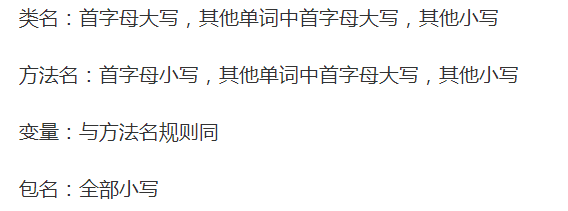
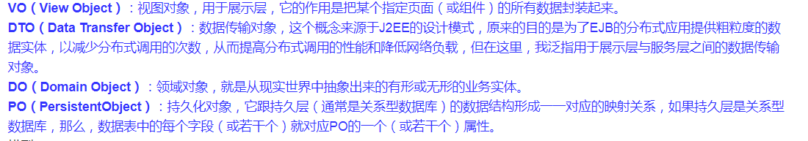
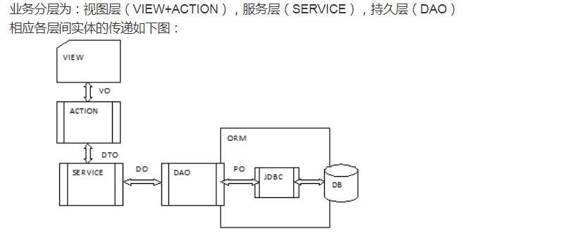

# ibdpmaster简介
ibdp
一共分为可视化、数据、用户、通知、分析、应用、API 共7个微服务。
##监控页面。

#规范

##命名规范:

##实体类创建规则:

###使用小辣椒创建 
参考:https://blog.csdn.net/sinat_34388323/article/details/81475647

###各类的范围:

参考:https://blog.csdn.net/paincupid/article/details/49924299/

##创建controller的支持Swagger
参考:https://blog.csdn.net/qq_39765049/article/details/78352550
具体用法:https://blog.csdn.net/u014231523/article/details/76522486

##如何在IntelliJ IDEA中使用.ignore插件忽略不必要提交的文件
https://blog.csdn.net/qq_34590097/article/details/56284935